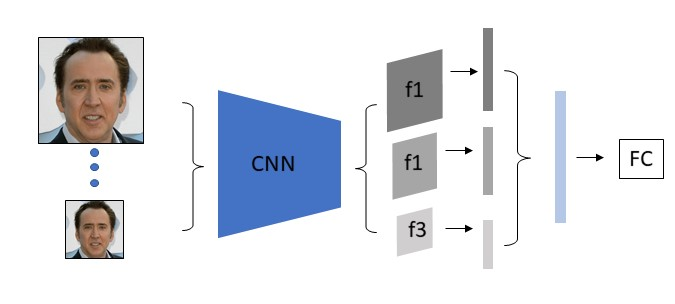

## DSP-FWA: Dual Spatial Pyramid for Exposing Face Warp Artifacts in DeepFake Videos 


### Overview
We propose an improved version of our previous work 
"Exposing DeepFake Videos By Detecting Face Warping Artifacts". We employ a dual spatial pyramid strategy on both
image and feature level to tackle multi-scale issues.

<p align="left">
  
</p>

### Requirements
- PyTorch 1.0.1
- Ubuntu >= 16.04
- CUDA >= 8.0
- Python3 with packages opencv3 and dlib

### Toy
Check `demo.py` in `toy` fodler. This script will return a list that contains the "fake" probability of each input data. 
Note we only suppert ResNet-50 based SSPNet model in this version. The checkpoint can be downloaded
 [here.](https://drive.google.com/open?id=13wbA5kHRGODBDdiJ2gPeB1XK4KiCh-Im)

```commandline
    python demo.py \
    --arch=sppnet \
    --layers=50 \
    --save_dir=../ckpt/ \
    --input=/path/of/video_or_image \
    --ckpt_name=SPP-res50.pth
```

    
### Citation

Please cite this paper in your publications if this repository helps your research:

    @inproceedings{li2019exposing,
      title={Exposing DeepFake Videos By Detecting Face Warping Artifacts},
      author={Li, Yuezun and Lyu, Siwei},
      booktitle={IEEE Conference on Computer Vision and Pattern Recognition Workshops (CVPRW)},
      year={2019}
    }
    
#### Notice
This repository is NOT for commecial use. It is provided "as it is" and we are not responsible for any subsequence of using this code.


